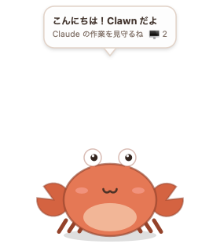
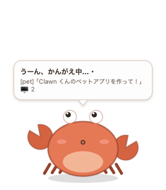
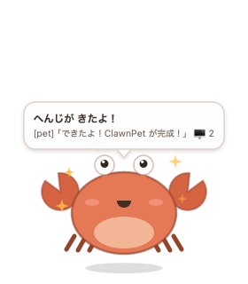
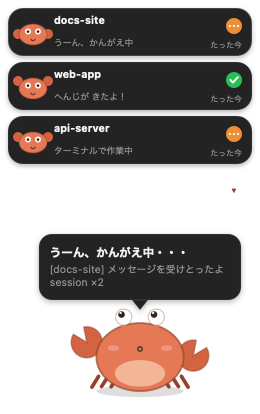

# 🦀 ClawnPet — Clawn くんデスクトップペット

  

**English → [README.en.md](README.en.md)**

Claude Desktop / Claude Code の作業をデスクトップの隅から見守って実況してくれる、
macOS ネイティブのデスクトップペットです。ChatGPT Desktop の Pet 機能のような
「アプリの外に住むマスコット」を Claude 用に作った MVP です。

> **非公式プロジェクトです。** Anthropic とは無関係で、公認・提携もありません。
> Claude アプリがローカルに書き出すファイルを**読むだけ**で動作し、
> ネットワーク送信・アプリへの介入・自動操作は一切行いません。

| 待機 | 考え中 | 作業中 | 返答が来た！ | マルチセッション |
|---|---|---|---|---|
|  |  |  |  |  |

## なにができる？

- **常時最前面のフローティング表示**（Dock には出ない・全スペース追従・フルスクリーン上にも出せる）
- **メッセージ送信を検知**して「かんがえ中」— 送ったプロンプトの本文を吹き出しに表示
- **ツール実行を実況** — 「ターミナルで作業中」「コードをカキカキ中」などツール別の実況
- **返答が来たらジャンプしてお祝い** — 応答本文の先頭を吹き出しに表示
- **セッションカード** — アクティブな全セッション（最大6）をカードでスタック表示。ミニカニが各セッションの気分を映す
- **カードをクリックでそのセッションへジャンプ** — `claude://resume` ディープリンクで Claude Desktop 上に該当セッションを開く
- **音声実況** — VOICEVOX またはシステム音声で「へんじがきたよ！」等をリアルタイム読み上げ（メニューで OFF/切替）
- **セッションごとに声が変わる** — プロジェクト名から VOICEVOX の話者を自動割り当て。どのセッションが喋ったか声で分かる
- **返信を通知センターに出す** — 応答が来たら macOS 通知（クリックでそのセッションへジャンプ）
- **claude.ai Web チャットにも対応（opt-in）** — Claude Desktop をデバッグポート付きで起動すれば、Web チャットの送信〜完了も実況
- **ドラッグすると進行方向を向く** — 移動中は体が傾き、目線と顔が動かした方向を追いかける。止まるとゆっくり正面に戻る
- **ふだんはミニ表示** — デフォルトは小さな Clawn（116×112）だけ。右上のバッジがアクティブセッション数を示し、作業中はオレンジ・ふだんは緑に変わる。クリックで展開するとカードとセリフのフル表示、もう一度クリックでミニに戻る。ミニ中も監視・音声実況・通知は継続
- **8分なにもないと寝る**（イベントが来たら起きる）
- 対象: **Claude Desktop 内の Claude Code（CCD）/ CLI / Cursor 拡張など全ての Claude Code セッション** + Claude Desktop アプリのメッセージ送信 + （opt-in で）claude.ai Web チャット

## インストール & 起動

```bash
./build.sh                        # ビルド（要 Xcode Command Line Tools / Swift）
open build/ClawnPet.app           # 起動
```

常用するなら:

```bash
cp -R build/ClawnPet.app /Applications/
open /Applications/ClawnPet.app
```

ログイン時に自動起動したい場合: システム設定 → 一般 → ログイン項目 に ClawnPet.app を追加。

## 操作

| 操作 | 動作 |
|---|---|
| クリック | ひらく／とじる（デフォルトはミニ表示） |
| セッションカードをクリック | そのセッションを Claude Desktop で開く |
| ドラッグ | 好きな場所に移動（位置は記憶される） |
| ダブルクリック | なでる（よろこぶ） |
| ▾ ボタン | セッションカードの表示/非表示 |
| 右クリック / メニューバーの 🦀 | メニュー（実況ボイス切替・開閉・デモ再生・終了など） |

## 状態一覧

| 状態 | トリガー | 見た目 |
|---|---|---|
| idle | 起動時・作業完了後 | ゆらゆら待機 |
| thinking | プロンプト送信を検知 | 目線が上に・20秒超で汗 |
| working | tool_use を検知 | ハサミをカタカタ・ツール名を実況 |
| celebrating | アシスタントの返答本文を検知 | ジャンプ＋キラキラ（7秒） |
| sleeping | 8分イベントなし | Zzz（イベントで起床） |

## 仕組み（読み取りのみ・外部送信なし）

ローカルのファイルを**読むだけ**で動きます。ネットワーク送信・書き込みは一切しません。

| 監視対象 | 得られる情報 |
|---|---|
| `~/.claude/projects/**/*.jsonl` | セッション transcript（ユーザー発話 / tool_use / 応答本文 / プロジェクト名） |
| `~/.claude/history.jsonl` | 送信したプロンプト本文（全セッション横断） |
| `~/Library/Logs/Claude/main.log` | Claude Desktop のメッセージ送信・セッション一時停止イベント |
| `~/.claude/sessions/*.json` | 稼働中セッション数（pid 生存確認つき） |

直近 30 分に動いた transcript（最大 6 本）を並行追尾し、メインの Clawn は
いちばん最近動いたセッションを実況します。詳しい調査結果は
[docs/FEASIBILITY.md](docs/FEASIBILITY.md)、設計の全体像は
[docs/architecture.html](docs/architecture.html) を参照。

### 音声実況（VOICEVOX 連携）

[VOICEVOX](https://voicevox.hiroshiba.jp/) が起動していれば（`localhost:50021`）、
ずんだもんが実況してくれます。VOICEVOX がいなければ macOS のシステム音声に自動フォールバック。
メニューバー 🦀 → 「こえ（実況ボイス）」で OFF / システム / VOICEVOX を切替できます。
「セッションごとに声を変える」を ON にすると、VOICEVOX にインストール済みの話者から
プロジェクトごとに自動で担当ボイスを割り当てます（どのセッションが喋ったか声で分かる）。

### 返信の通知

応答が届くと macOS の通知センターにも出せます（🦀 メニュー → 「返信を通知センターに出す」）。
署名済みでない ad-hoc ビルドでは OS が通知許可を出さないため、その場合は自動で
`osascript` 経由のフォールバック通知に切り替わります（表示は出ます）。

### claude.ai Web チャット対応（opt-in / CDP）

Claude Desktop を**デバッグポート付きで起動**すると、Web チャットの送信〜応答完了も実況できます。

```bash
osascript -e 'quit app "Claude"'; sleep 2
open -a Claude --args --remote-debugging-port=9222
# 別ターミナルで ClawnPet をポート指定起動
CLAWN_CDP_PORT=9222 open -n /Applications/ClawnPet.app
```

`CLAWN_CDP_PORT` が未指定なら CDP 監視は無効（デフォルト）。ポートが開いていなければ静かに無視します。
Web チャットは本文が取れないため「Web チャットで考え中 → 応答完了」の粒度で実況します。
> ⚠️ デバッグポートはローカルの全プロセスから接続可能になるため、常用は非推奨です。

## デバッグ用環境変数

| 変数 | 意味 |
|---|---|
| `CLAWN_DEBUG=1` | イベント/状態遷移を stderr にログ |
| `CLAWN_DEMO=1` | 起動時に全モーションのデモを再生 |
| `CLAWN_WATCH_DIR` / `CLAWN_HISTORY` / `CLAWN_MAINLOG` | 監視パスの差し替え（テスト用） |
| `CLAWN_SNAPSHOT_PATH` | スナップショット PNG の保存先 |
| `CLAWN_TEST_FACING` | 向き演出を固定（`1`=右向き, `-1`=左向き。見た目検証用） |

シグナル: `SIGUSR1` = スナップショット保存、`SIGUSR2` = デモ開始/停止。

## アンインストール

メニューバー 🦀 → 「Clawn を終了」→ `/Applications/ClawnPet.app` を削除。
（保存されるのはウィンドウ位置の UserDefaults のみ）

## プロジェクト構成

```
Sources/ClawnPet/
├── main.swift         # エントリポイント
├── AppDelegate.swift  # ウィンドウ・メニューバー・タイマー・デモ・シグナル
├── PetCore.swift      # PetEvent / PetBrain（状態マシン）
├── PetView.swift      # Clawn くんの描画・アニメーション・吹き出し
└── Watchers.swift     # TailReader / transcript・history・main.log の監視
```
